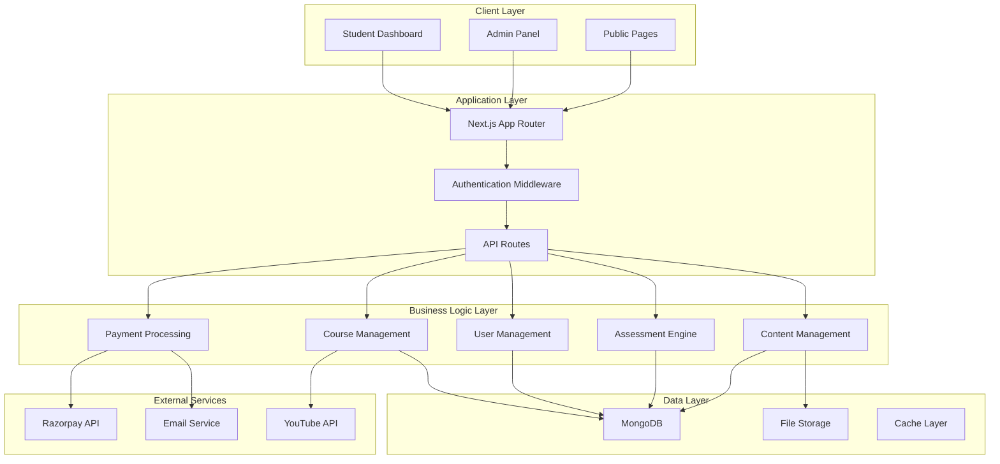

# Design Document

## Overview

The Premium LMS + Coaching Management System is a comprehensive full-stack application built with Next.js 15 App Router, featuring modern authentication, course management, e-commerce capabilities, assessment systems, and administrative controls. The system serves both students and administrators with role-based access, integrated payment processing, and optimized performance.

## Architecture

### Technology Stack

**Frontend:**
- Next.js 15 with App Router for server-side rendering and static generation
- React 19 for component architecture
- TailwindCSS v4 for styling with CSS-first configuration
- Shadcn/ui components for consistent UI elements
- Framer Motion for smooth animations

**Backend:**
- Next.js API Routes for serverless functions
- MongoDB with Mongoose for data persistence
- JWT for authentication and session management
- Razorpay for payment processing

**Infrastructure:**
- Vercel for deployment and hosting
- MongoDB Atlas for database hosting
- Cloudinary for image optimization and storage

### System Architecture



## Components and Interfaces

### Authentication System

**JWT Implementation:**
- Access tokens with 15-minute expiration
- Refresh tokens with 7-day expiration
- Secure HTTP-only cookies for token storage
- Role-based access control (student, admin)

**Middleware Protection:**
```typescript
interface AuthMiddleware {
  validateToken(token: string): Promise<User | null>
  checkRole(user: User, requiredRole: string): boolean
  refreshToken(refreshToken: string): Promise<string>
}
```

### Course Management System

**Course Structure:**
```typescript
interface Course {
  id: string
  title: string
  description: string
  price: number
  category: string
  thumbnail: string
  level: 'beginner' | 'intermediate' | 'advanced'
  tags: string[]
  modules: Module[]
  createdAt: Date
  updatedAt: Date
}

interface Module {
  id: string
  title: string
  order: number
  chapters: Chapter[]
}

interface Chapter {
  id: string
  title: string
  order: number
  lessons: Lesson[]
}

interface Lesson {
  id: string
  title: string
  type: 'video' | 'pdf' | 'text'
  content: string
  duration?: number
  order: number
  isLocked: boolean
}
```

**Video Embedding:**
- YouTube privacy-enhanced mode for secure embedding
- Custom video player controls
- Progress tracking and resume functionality
- Adaptive streaming based on connection quality

### E-commerce System

**Product Management:**
```typescript
interface Book {
  id: string
  title: string
  author: string
  description: string
  price: number
  discountPrice?: number
  category: string
  subcategory: string
  images: string[]
  stock: number
  isbn: string
  tags: string[]
  isNewArrival: boolean
}

interface Cart {
  userId: string
  items: CartItem[]
  totalAmount: number
  createdAt: Date
  updatedAt: Date
}

interface CartItem {
  bookId: string
  quantity: number
  price: number
}
```

**Order Processing:**
```typescript
interface Order {
  id: string
  userId: string
  items: OrderItem[]
  totalAmount: number
  paymentStatus: 'pending' | 'completed' | 'failed' | 'refunded'
  razorpayOrderId: string
  razorpayPaymentId?: string
  shippingAddress: Address
  orderStatus: 'processing' | 'shipped' | 'delivered' | 'cancelled'
  createdAt: Date
}
```

### Assessment System

**Mock Test Engine:**
```typescript
interface MockTest {
  id: string
  title: string
  description: string
  duration: number // in minutes
  totalMarks: number
  negativeMarking: number
  instructions: string[]
  sections: TestSection[]
  isActive: boolean
  createdAt: Date
}

interface TestSection {
  id: string
  title: string
  questions: Question[]
  timeLimit?: number
}

interface Question {
  id: string
  text: string
  options: string[]
  correctAnswer: number
  explanation: string
  marks: number
  difficulty: 'easy' | 'medium' | 'hard'
  subject: string
}

interface TestAttempt {
  id: string
  userId: string
  testId: string
  answers: UserAnswer[]
  score: number
  rank: number
  timeSpent: number
  submittedAt: Date
}
```

### Payment Integration

**Razorpay Integration:**
```typescript
interface PaymentOrder {
  id: string
  amount: number
  currency: string
  receipt: string
  notes: Record<string, string>
}

interface PaymentVerification {
  razorpay_order_id: string
  razorpay_payment_id: string
  razorpay_signature: string
}

interface WebhookPayload {
  entity: string
  account_id: string
  event: string
  contains: string[]
  payload: {
    payment: {
      entity: PaymentEntity
    }
  }
}
```

## Data Models

### User Schema
```typescript
interface User {
  _id: ObjectId
  email: string
  password: string // bcrypt hashed
  firstName: string
  lastName: string
  phone?: string
  role: 'student' | 'admin'
  profile: {
    avatar?: string
    dateOfBirth?: Date
    address?: Address
    education?: string
    parentDetails?: ParentDetails
  }
  enrolledCourses: ObjectId[]
  purchasedBooks: ObjectId[]
  testAttempts: ObjectId[]
  isActive: boolean
  emailVerified: boolean
  createdAt: Date
  updatedAt: Date
}
```

### Course Progress Schema
```typescript
interface CourseProgress {
  _id: ObjectId
  userId: ObjectId
  courseId: ObjectId
  completedLessons: ObjectId[]
  currentLesson?: ObjectId
  progressPercentage: number
  timeSpent: number
  certificateIssued: boolean
  completedAt?: Date
  createdAt: Date
  updatedAt: Date
}
```

### Study Material Schema
```typescript
interface StudyMaterial {
  _id: ObjectId
  title: string
  description: string
  type: 'pdf' | 'notes' | 'previous_paper'
  category: string
  examType: string
  year?: number
  fileUrl: string
  thumbnailUrl?: string
  isPaid: boolean
  price?: number
  downloadCount: number
  tags: string[]
  createdAt: Date
  updatedAt: Date
}
```

### Current Affairs Schema
```typescript
interface CurrentAffair {
  _id: ObjectId
  title: string
  content: string
  summary: string
  category: string
  date: Date
  type: 'daily' | 'monthly'
  isPremium: boolean
  tags: string[]
  viewCount: number
  imageUrl?: string
  slug: string
  seoTitle: string
  seoDescription: string
  createdAt: Date
  updatedAt: Date
}
```

Now I'll use the prework tool to analyze the acceptance criteria before writing the correctness properties.
