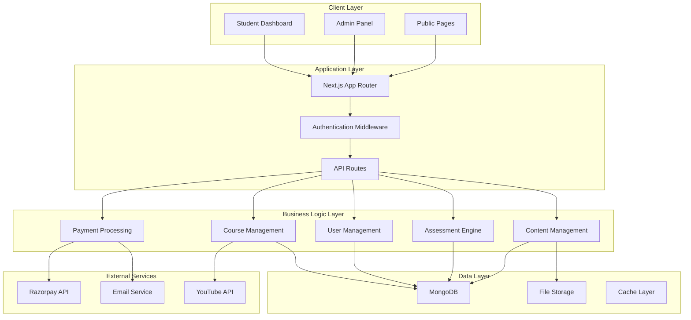

# Design Document

## Overview

The Premium LMS + Coaching Management System is a comprehensive full-stack application built with Next.js 15 App Router, featuring modern authentication, course management, e-commerce capabilities, assessment systems, and administrative controls. The system serves both students and administrators with role-based access, integrated payment processing, and optimized performance.

## Architecture

### Technology Stack

**Frontend:**
- Next.js 15 with App Router for server-side rendering and static generation
- React 19 for component architecture
- TailwindCSS v4 for styling with CSS-first configuration
- Shadcn/ui components for consistent UI elements
- Framer Motion for smooth animations

**Backend:**
- Next.js API Routes for serverless functions
- MongoDB with Mongoose for data persistence
- JWT for authentication and session management
- Razorpay for payment processing

**Infrastructure:**
- Vercel for deployment and hosting
- MongoDB Atlas for database hosting
- Cloudinary for image optimization and storage

### System Architecture



## Components and Interfaces

### Authentication System

**JWT Implementation:**
- Access tokens with 15-minute expiration
- Refresh tokens with 7-day expiration
- Secure HTTP-only cookies for token storage
- Role-based access control (student, admin)

**Middleware Protection:**
```javascript
// AuthMiddleware functions
const validateToken = async (token) => {
  // Returns user object or null
}

const checkRole = (user, requiredRole) => {
  // Returns boolean
}

const refreshToken = async (refreshToken) => {
  // Returns new token string
}
```

### Course Management System

**Course Structure:**
```javascript
// Course object structure
const courseSchema = {
  id: String,
  title: String,
  description: String,
  price: Number,
  category: String,
  thumbnail: String,
  level: String, // 'beginner' | 'intermediate' | 'advanced'
  tags: [String],
  modules: [moduleSchema],
  createdAt: Date,
  updatedAt: Date
}

const moduleSchema = {
  id: String,
  title: String,
  order: Number,
  chapters: [chapterSchema]
}

const chapterSchema = {
  id: String,
  title: String,
  order: Number,
  lessons: [lessonSchema]
}

const lessonSchema = {
  id: String,
  title: String,
  type: String, // 'video' | 'pdf' | 'text'
  content: String,
  duration: Number, // optional
  order: Number,
  isLocked: Boolean
}
```

**Video Embedding:**
- YouTube privacy-enhanced mode for secure embedding
- Custom video player controls
- Progress tracking and resume functionality
- Adaptive streaming based on connection quality

### E-commerce System

**Product Management:**
```javascript
const bookSchema = {
  id: String,
  title: String,
  author: String,
  description: String,
  price: Number,
  discountPrice: Number, // optional
  category: String,
  subcategory: String,
  images: [String],
  stock: Number,
  isbn: String,
  tags: [String],
  isNewArrival: Boolean
}

const cartSchema = {
  userId: String,
  items: [cartItemSchema],
  totalAmount: Number,
  createdAt: Date,
  updatedAt: Date
}

const cartItemSchema = {
  bookId: String,
  quantity: Number,
  price: Number
}
```

**Order Processing:**
```javascript
const orderSchema = {
  id: String,
  userId: String,
  items: [orderItemSchema],
  totalAmount: Number,
  paymentStatus: String, // 'pending' | 'completed' | 'failed' | 'refunded'
  razorpayOrderId: String,
  razorpayPaymentId: String, // optional
  shippingAddress: addressSchema,
  orderStatus: String, // 'processing' | 'shipped' | 'delivered' | 'cancelled'
  createdAt: Date
}
```

### Assessment System

**Mock Test Engine:**
```javascript
const mockTestSchema = {
  id: String,
  title: String,
  description: String,
  duration: Number, // in minutes
  totalMarks: Number,
  negativeMarking: Number,
  instructions: [String],
  sections: [testSectionSchema],
  isActive: Boolean,
  createdAt: Date
}

const testSectionSchema = {
  id: String,
  title: String,
  questions: [questionSchema],
  timeLimit: Number // optional
}

const questionSchema = {
  id: String,
  text: String,
  options: [String],
  correctAnswer: Number,
  explanation: String,
  marks: Number,
  difficulty: String, // 'easy' | 'medium' | 'hard'
  subject: String
}

const testAttemptSchema = {
  id: String,
  userId: String,
  testId: String,
  answers: [userAnswerSchema],
  score: Number,
  rank: Number,
  timeSpent: Number,
  submittedAt: Date
}
```

### Payment Integration

**Razorpay Integration:**
```javascript
const paymentOrderSchema = {
  id: String,
  amount: Number,
  currency: String,
  receipt: String,
  notes: Object // key-value pairs
}

const paymentVerificationSchema = {
  razorpay_order_id: String,
  razorpay_payment_id: String,
  razorpay_signature: String
}

const webhookPayloadSchema = {
  entity: String,
  account_id: String,
  event: String,
  contains: [String],
  payload: {
    payment: {
      entity: Object // PaymentEntity
    }
  }
}
```

## Data Models

### User Schema
```javascript
const userSchema = {
  _id: ObjectId,
  email: String,
  password: String, // bcrypt hashed
  firstName: String,
  lastName: String,
  phone: String, // optional
  role: String, // 'student' | 'admin'
  profile: {
    avatar: String, // optional
    dateOfBirth: Date, // optional
    address: Object, // optional
    education: String, // optional
    parentDetails: Object // optional
  },
  enrolledCourses: [ObjectId],
  purchasedBooks: [ObjectId],
  testAttempts: [ObjectId],
  isActive: Boolean,
  emailVerified: Boolean,
  createdAt: Date,
  updatedAt: Date
}
```

### Course Progress Schema
```javascript
const courseProgressSchema = {
  _id: ObjectId,
  userId: ObjectId,
  courseId: ObjectId,
  completedLessons: [ObjectId],
  currentLesson: ObjectId, // optional
  progressPercentage: Number,
  timeSpent: Number,
  certificateIssued: Boolean,
  completedAt: Date, // optional
  createdAt: Date,
  updatedAt: Date
}
```

### Study Material Schema
```javascript
const studyMaterialSchema = {
  _id: ObjectId,
  title: String,
  description: String,
  type: String, // 'pdf' | 'notes' | 'previous_paper'
  category: String,
  examType: String,
  year: Number, // optional
  fileUrl: String,
  thumbnailUrl: String, // optional
  isPaid: Boolean,
  price: Number, // optional
  downloadCount: Number,
  tags: [String],
  createdAt: Date,
  updatedAt: Date
}
```

### Current Affairs Schema
```javascript
const currentAffairSchema = {
  _id: ObjectId,
  title: String,
  content: String,
  summary: String,
  category: String,
  date: Date,
  type: String, // 'daily' | 'monthly'
  isPremium: Boolean,
  tags: [String],
  viewCount: Number,
  imageUrl: String, // optional
  slug: String,
  seoTitle: String,
  seoDescription: String,
  createdAt: Date,
  updatedAt: Date
}
```

Now I'll use the prework tool to analyze the acceptance criteria before writing the correctness properties.

## Correctness Properties

*A property is a characteristic or behavior that should hold true across all valid executions of a system—essentially, a formal statement about what the system should do. Properties serve as the bridge between human-readable specifications and machine-verifiable correctness guarantees.*

### Authentication Properties

**Property 1: Registration creates secure credentials**
*For any* valid user registration data (email, password), the authentication system should create a bcrypt-hashed password and generate a valid JWT token
**Validates: Requirements 1.1**

**Property 2: Admin access control**
*For any* admin user with valid credentials, the authentication system should provide admin-level access permissions
**Validates: Requirements 1.2**

**Property 3: Route protection enforcement**
*For any* protected route accessed without valid authentication, the system should redirect to the login page
**Validates: Requirements 1.3**

**Property 4: Password reset security**
*For any* valid user email requesting password reset, the system should generate a secure reset link and send it via email
**Validates: Requirements 1.4**

**Property 5: Session tracking consistency**
*For any* user session created from different devices, the system should track and maintain session information correctly
**Validates: Requirements 1.5**

### Course Management Properties

**Property 6: Course creation completeness**
*For any* course created by an admin, all required fields (title, description, price, category, thumbnail, level, tags) should be stored correctly
**Validates: Requirements 2.1**

**Property 7: Content hierarchy preservation**
*For any* course with nested content structure, the modules → chapters → lessons hierarchy should be maintained correctly
**Validates: Requirements 2.2**

**Property 8: Video embedding privacy**
*For any* lesson containing a YouTube URL, the video should be embedded in privacy mode without YouTube branding
**Validates: Requirements 2.3**

**Property 9: Content access control**
*For any* student not enrolled in a course, video content should be locked and enrollment prompt should be displayed
**Validates: Requirements 2.5**

**Property 10: Certificate generation**
*For any* student who completes all lessons in a course, a completion certificate should be generated
**Validates: Requirements 2.6**

**Property 11: Progress tracking accuracy**
*For any* lesson marked complete by a student, the progress tracking should be updated correctly
**Validates: Requirements 2.7**

### E-commerce Properties

**Property 12: Cart persistence**
*For any* user adding items to cart, the cart state should be maintained across sessions
**Validates: Requirements 3.3**

**Property 13: Payment integration security**
*For any* checkout process, the system should integrate securely with Razorpay for payment processing
**Validates: Requirements 3.4**

**Property 14: Order confirmation completeness**
*For any* successful payment, the system should generate both confirmation page and email notification
**Validates: Requirements 3.5**

**Property 15: Inventory management real-time updates**
*For any* admin inventory changes (stock, price, discount), the book store should reflect updates in real-time
**Validates: Requirements 3.7**

### Study Material Properties

**Property 16: Content access control by payment status**
*For any* study material marked as paid, the system should require payment verification before allowing access
**Validates: Requirements 4.3**

**Property 17: Download tracking accuracy**
*For any* study material download, the system should increment download count correctly
**Validates: Requirements 4.4**

**Property 18: Search filtering precision**
*For any* study material search with filters (exam, category, year), results should match all applied filter criteria
**Validates: Requirements 4.5**

### Assessment Properties

**Property 19: Test timer auto-submission**
*For any* mock test with expired timer, the system should auto-submit user responses
**Validates: Requirements 6.2**

**Property 20: Score calculation with negative marking**
*For any* completed mock test, the score should be calculated correctly applying negative marking rules
**Validates: Requirements 6.3**

**Property 21: Ranking generation accuracy**
*For any* completed mock test, the system should generate rankings based on performance scores
**Validates: Requirements 6.4**

**Property 22: Anti-cheating protection**
*For any* active mock test, the system should prevent cheating through refresh protection mechanisms
**Validates: Requirements 6.8**

### Payment Properties

**Property 23: Payment order creation security**
*For any* payment initiation, the system should create a secure Razorpay order with proper validation
**Validates: Requirements 9.1**

**Property 24: Payment capture and status update**
*For any* successful payment, the system should capture payment and update order status correctly
**Validates: Requirements 9.2**

**Property 25: Webhook handling reliability**
*For any* payment webhook received, the system should handle and process payment status updates correctly
**Validates: Requirements 9.3**

**Property 26: Payment retry functionality**
*For any* failed payment, the system should allow retry attempts with proper error handling
**Validates: Requirements 9.7**

### Administrative Properties

**Property 27: Dashboard analytics accuracy**
*For any* admin dashboard access, the system should display accurate analytics for students, orders, revenue, and test attempts
**Validates: Requirements 10.1**

**Property 28: CRUD operations completeness**
*For any* admin CRUD operation on system entities (users, courses, tests, books), the operation should complete successfully with proper validation
**Validates: Requirements 10.2**

**Property 29: Bulk upload processing**
*For any* CSV file uploaded for bulk operations, the system should process and validate all entries correctly
**Validates: Requirements 10.3**

### UI and Performance Properties

**Property 30: Theme switching consistency**
*For any* dark/light mode toggle, the entire UI should switch themes consistently across all components
**Validates: Requirements 11.2**

**Property 31: Responsive design functionality**
*For any* screen size (mobile, tablet, desktop), the system should display and function correctly
**Validates: Requirements 11.5**

**Property 32: Image optimization automation**
*For any* image uploaded to the system, automatic optimization should be applied
**Validates: Requirements 11.7**

**Property 33: SEO meta tag generation**
*For any* page in the system, appropriate SEO meta tags should be generated automatically
**Validates: Requirements 12.2**
